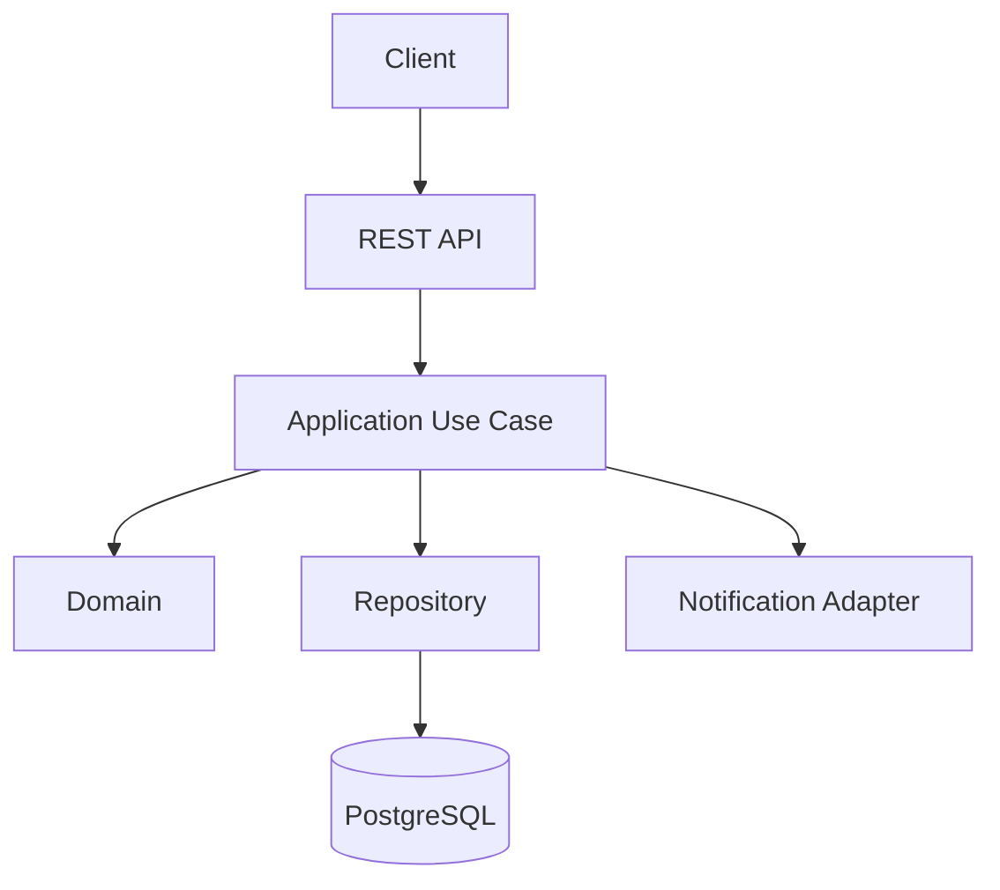

# SPEC.md — Projeto Moderno de Design Patterns com Kotlin

## 1. Visão Geral

Este projeto tem como objetivo consolidar, na prática, os conhecimentos de **Design Patterns**, **Programação Orientada a Objetos**, **SOLID**, **DRY**, arquitetura limpa e desenvolvimento moderno utilizando **Kotlin**.

A proposta é transformar o desafio original de implementação de padrões de projeto em um projeto de portfólio mais completo, aplicando boas práticas utilizadas em aplicações profissionais.

O projeto deverá ser desenvolvido preferencialmente utilizando:

* Kotlin;
* Java 21+ / JVM;
* Spring Boot;
* Gradle Kotlin DSL;
* Spring Data JPA;
* PostgreSQL;
* Docker;
* Testes automatizados;
* OpenAPI/Swagger;
* arquitetura modular;
* princípios SOLID;
* princípio DRY;
* Clean Code;
* Design Patterns;
* princípios de Domain-Driven Design quando fizer sentido.

O projeto deverá priorizar **qualidade arquitetural, manutenibilidade, testabilidade e baixo acoplamento**, evitando complexidade artificial.

---

# 2. Objetivo

Construir uma aplicação backend moderna que demonstre, de forma prática, a utilização de diferentes padrões de projeto e princípios de engenharia de software.

O projeto deve permitir demonstrar no portfólio não apenas que determinados Design Patterns foram implementados, mas também:

1. por que determinado padrão foi escolhido;
2. qual problema ele resolve;
3. quais alternativas foram consideradas;
4. como ele contribui para a arquitetura;
5. como os princípios SOLID são aplicados;
6. como evitar duplicação utilizando DRY;
7. como testar os componentes;
8. como evoluir a aplicação sem gerar alto acoplamento.

---

# 3. Desafio Original

O desafio consiste em consolidar os conhecimentos adquiridos sobre **Padrões de Projeto (Design Patterns)**.

Existem três possibilidades originalmente propostas:

### 3.1 Reproduzir e Evoluir

Reproduzir o projeto apresentado durante o treinamento e evoluí-lo com melhorias próprias.

### 3.2 Criar do Zero

Desenvolver uma nova aplicação ou API aplicando os padrões de projeto estudados.

### 3.3 Focar em um Padrão

Desenvolver uma implementação menor concentrada em um Design Pattern específico, como:

* Chain of Responsibility;
* Strategy;
* Factory;
* Builder;
* Observer;
* Singleton;
* Adapter;
* Facade;
* Template Method;
* entre outros.

Para este projeto, será adotada a abordagem:

> **Criar do zero + aplicar múltiplos Design Patterns + arquitetura moderna + SOLID + DRY.**

---

# 4. Proposta do Projeto

## 4.1 Nome provisório

**PatternHub**

> Plataforma de demonstração de Design Patterns através de uma API REST moderna desenvolvida com Kotlin.

O nome poderá ser alterado posteriormente.

---

# 5. Problema

Aplicações reais frequentemente precisam lidar com diferentes regras de negócio, integrações, validações, notificações e estratégias de processamento.

Quando essas responsabilidades são implementadas diretamente nos Controllers ou em grandes classes de serviço, surgem problemas como:

* alto acoplamento;
* código duplicado;
* dificuldade para testar;
* dificuldade para adicionar novas regras;
* classes excessivamente grandes;
* violação do Single Responsibility Principle;
* dependência direta de implementações concretas;
* dificuldade para substituir componentes;
* crescimento descontrolado da complexidade.

O projeto deverá demonstrar como esses problemas podem ser evitados através de uma arquitetura orientada a responsabilidades e padrões de projeto.

---

# 6. Requisitos Funcionais

## RF-001 — Cadastro de usuários

A aplicação deverá permitir cadastrar usuários.

Dados mínimos:

* ID;
* nome;
* e-mail;
* data de criação;
* status.

---

## RF-002 — Cadastro de solicitações

O usuário poderá criar uma solicitação.

Uma solicitação deverá possuir:

* ID;
* usuário;
* tipo;
* descrição;
* prioridade;
* status;
* data de criação;
* data de atualização.

---

## RF-003 — Processamento da solicitação

A aplicação deverá possuir um pipeline responsável por processar solicitações.

O processamento poderá envolver:

1. validação;
2. autenticação/autorização;
3. aplicação de regras;
4. definição de prioridade;
5. persistência;
6. notificação;
7. auditoria.

---

## RF-004 — Estratégias de processamento

O sistema deverá permitir diferentes estratégias de processamento.

Exemplos:

* processamento normal;
* processamento prioritário;
* processamento urgente;
* processamento programado.

Novas estratégias deverão poder ser adicionadas sem modificar excessivamente o código existente.

---

## RF-005 — Notificações

O sistema deverá permitir enviar notificações por diferentes canais.

Canais iniciais:

* e-mail;
* push;
* webhook.

A arquitetura deverá permitir adicionar novos canais posteriormente.

---

## RF-006 — Auditoria

Eventos importantes deverão ser registrados.

Exemplos:

* criação da solicitação;
* alteração de status;
* processamento;
* envio de notificação;
* falha de processamento.

---

## RF-007 — Consulta

A API deverá permitir:

* consultar uma solicitação;
* listar solicitações;
* filtrar por status;
* filtrar por prioridade;
* consultar solicitações de um usuário.

---

# 7. Requisitos Não Funcionais

## RNF-001 — Linguagem

O projeto deverá utilizar **Kotlin** como linguagem principal.

---

## RNF-002 — JVM

Utilizar uma versão LTS moderna da JVM.

Preferencialmente:

```text
Java 21+
```

---

## RNF-003 — Framework

Utilizar:

```text
Spring Boot
```

---

## RNF-004 — Build

Utilizar:

```text
Gradle Kotlin DSL
```

---

## RNF-005 — Banco de dados

Utilizar:

```text
PostgreSQL
```

---

## RNF-006 — Containerização

A aplicação deverá possuir suporte a:

```text
Docker
Docker Compose
```

---

## RNF-007 — Testabilidade

A arquitetura deverá permitir testes unitários sem necessidade de subir toda a aplicação.

---

## RNF-008 — Documentação

A API deverá ser documentada utilizando:

```text
OpenAPI
Swagger UI
```

---

## RNF-009 — Qualidade

O código deverá seguir:

* Clean Code;
* SOLID;
* DRY;
* baixo acoplamento;
* alta coesão;
* composição em preferência à herança quando apropriado;
* programação orientada a interfaces;
* imutabilidade sempre que possível.

---

# 8. Princípios SOLID

O projeto deverá demonstrar explicitamente os cinco princípios SOLID.

## S — Single Responsibility Principle

Cada classe deverá possuir uma responsabilidade bem definida.

Exemplo:

```text
RequestService
NotificationService
AuditService
UserService
```

Evitar classes como:

```text
MegaRequestService
```

responsáveis por validação, persistência, notificações e auditoria simultaneamente.

---

## O — Open/Closed Principle

O sistema deverá estar aberto para extensão e fechado para modificações desnecessárias.

Exemplo:

```kotlin
interface NotificationChannel {
    fun send(notification: Notification)
}
```

Implementações:

```text
EmailNotificationChannel
PushNotificationChannel
WebhookNotificationChannel
```

Adicionar um novo canal não deverá exigir alterações no código existente de outros canais.

---

## L — Liskov Substitution Principle

Implementações de uma abstração deverão poder ser utilizadas sem quebrar o comportamento esperado.

---

## I — Interface Segregation Principle

Evitar interfaces gigantes.

Preferir:

```kotlin
interface NotificationSender
interface NotificationValidator
interface NotificationFormatter
```

em vez de uma interface contendo responsabilidades não relacionadas.

---

## D — Dependency Inversion Principle

As regras de negócio deverão depender de abstrações, e não diretamente de implementações concretas.

Exemplo:

```kotlin
class ProcessRequestUseCase(
    private val repository: RequestRepository,
    private val notificationService: NotificationService
)
```

---

# 9. Princípio DRY

O projeto deverá evitar duplicação de:

* regras de negócio;
* validações;
* conversões;
* queries;
* tratamento de erros;
* configurações;
* lógica de notificações.

Entretanto, DRY não deverá ser utilizado de forma exagerada.

O objetivo não é eliminar qualquer repetição textual, mas evitar **duplicação de conhecimento e regras de negócio**.

---

# 10. Design Patterns

O projeto deverá utilizar Design Patterns somente quando eles resolverem problemas reais da aplicação.

## 10.1 Strategy

Utilizar para representar diferentes estratégias de processamento.

Exemplo:

```kotlin
interface ProcessingStrategy {
    fun process(request: Request): ProcessingResult
}
```

Implementações:

```text
NormalProcessingStrategy
PriorityProcessingStrategy
UrgentProcessingStrategy
```

---

# 11. Chain of Responsibility

Utilizar para construir o pipeline de processamento.

Exemplo conceitual:

```text
Request
   ↓
ValidationHandler
   ↓
AuthorizationHandler
   ↓
PriorityHandler
   ↓
ProcessingHandler
   ↓
NotificationHandler
   ↓
AuditHandler
```

Cada handler deverá possuir uma responsabilidade específica.

---

# 12. Factory

Utilizar para criação de objetos quando a lógica de construção variar de acordo com um determinado contexto.

Exemplo:

```kotlin
interface NotificationFactory {
    fun create(type: NotificationType): NotificationSender
}
```

---

# 13. Builder

Utilizar quando determinado objeto possuir muitos parâmetros ou uma construção complexa.

Preferir recursos idiomáticos do Kotlin quando eles tornarem o Builder desnecessário.

Exemplo:

```kotlin
data class Notification(
    val recipient: String,
    val subject: String,
    val message: String,
    val metadata: Map<String, String> = emptyMap()
)
```

O pattern deverá ser aplicado somente quando agregar valor.

---

# 14. Adapter

Utilizar para desacoplar integrações externas.

Exemplo:

```text
NotificationProvider
        ↓
EmailProviderAdapter
        ↓
ExternalEmailProvider
```

Isso permitirá substituir um fornecedor externo sem alterar as regras de negócio.

---

# 15. Facade

Utilizar para fornecer uma interface simples para operações que envolvem múltiplos componentes.

Exemplo:

```kotlin
class RequestProcessingFacade(
    private val validationService: ValidationService,
    private val processingService: ProcessingService,
    private val notificationService: NotificationService,
    private val auditService: AuditService
)
```

---

# 16. Observer / Event-Driven

Eventos de domínio poderão ser utilizados para desacoplar processos secundários.

Exemplo:

```text
RequestCreatedEvent
RequestProcessedEvent
RequestStatusChangedEvent
```

Fluxo:

```text
RequestService
      ↓
Domain Event
      ↓
┌───────────────┬────────────────┬──────────────┐
↓               ↓                ↓
Notification    Audit            Metrics
```

---

# 17. Repository Pattern

O domínio não deverá depender diretamente de JPA ou PostgreSQL.

Exemplo:

```kotlin
interface RequestRepository {
    fun save(request: Request): Request
    fun findById(id: UUID): Request?
}
```

A implementação ficará na camada de infraestrutura.

---

# 18. Arquitetura

O projeto deverá utilizar uma arquitetura inspirada em:

```text
Clean Architecture
+
Hexagonal Architecture
+
Domain-Driven Design
```

Não será necessário implementar DDD de forma excessivamente burocrática.

A prioridade será manter as responsabilidades claramente separadas.

---

# 19. Estrutura de Diretórios

Estrutura sugerida:

```text
pattern-hub/
│
├── src/
│   ├── main/
│   │   ├── kotlin/
│   │   │   └── com/
│   │   │       └── example/
│   │   │           └── patternhub/
│   │   │
│   │   │               ├── PatternHubApplication.kt
│   │   │               │
│   │   │               ├── domain/
│   │   │               │   ├── entity/
│   │   │               │   ├── valueobject/
│   │   │               │   ├── repository/
│   │   │               │   ├── service/
│   │   │               │   ├── event/
│   │   │               │   └── exception/
│   │   │               │
│   │   │               ├── application/
│   │   │               │   ├── usecase/
│   │   │               │   ├── dto/
│   │   │               │   └── mapper/
│   │   │               │
│   │   │               ├── infrastructure/
│   │   │               │   ├── persistence/
│   │   │               │   ├── notification/
│   │   │               │   ├── integration/
│   │   │               │   └── configuration/
│   │   │               │
│   │   │               └── interfaces/
│   │   │                   └── rest/
│   │   │                       ├── controller/
│   │   │                       ├── request/
│   │   │                       └── response/
│   │   │
│   │   └── resources/
│   │       ├── application.yml
│   │       └── db/
│   │           └── migration/
│   │
│   └── test/
│       └── kotlin/
│
├── docs/
│   ├── architecture/
│   ├── design-patterns/
│   ├── api/
│   └── decisions/
│
├── docker/
│
├── .github/
│   └── workflows/
│
├── Dockerfile
├── docker-compose.yml
├── build.gradle.kts
├── settings.gradle.kts
├── README.md
└── SPEC.md
```

---

# 20. Separação de Camadas

## Domain

Deve conter as regras de negócio mais importantes.

Não deverá depender de:

* Spring;
* JPA;
* PostgreSQL;
* HTTP;
* bibliotecas externas desnecessárias.

---

## Application

Deverá representar os casos de uso da aplicação.

Exemplos:

```text
CreateRequestUseCase
ProcessRequestUseCase
CancelRequestUseCase
GetRequestUseCase
ListRequestsUseCase
```

---

## Infrastructure

Responsável por detalhes externos:

* PostgreSQL;
* Spring Data;
* APIs externas;
* envio de e-mail;
* mensageria;
* observabilidade.

---

## Interfaces

Responsável pela comunicação com o mundo externo.

Inicialmente:

```text
REST API
```

Posteriormente:

```text
GraphQL
Mensageria
CLI
```

poderão ser adicionados sem alterar o domínio.

---

# 21. API REST

## POST /api/v1/requests

Cria uma nova solicitação.

### Request

```json
{
  "userId": "uuid",
  "type": "NORMAL",
  "description": "Descrição da solicitação"
}
```

### Response

```json
{
  "id": "uuid",
  "status": "CREATED",
  "createdAt": "2026-08-14T10:00:00Z"
}
```

---

## GET /api/v1/requests/{id}

Consulta uma solicitação.

---

## GET /api/v1/requests

Lista solicitações.

Filtros sugeridos:

```text
status
priority
userId
type
createdFrom
createdTo
```

---

## POST /api/v1/requests/{id}/process

Processa uma solicitação.

---

## POST /api/v1/requests/{id}/cancel

Cancela uma solicitação.

---

# 22. Tratamento de Erros

A API deverá possuir tratamento global de exceções.

Utilizar mecanismo equivalente a:

```kotlin
@RestControllerAdvice
```

As respostas deverão possuir formato padronizado.

Exemplo:

```json
{
  "timestamp": "2026-08-14T10:00:00Z",
  "status": 400,
  "code": "INVALID_REQUEST",
  "message": "A solicitação é inválida.",
  "path": "/api/v1/requests"
}
```

Não expor stack traces ou detalhes internos da aplicação em produção.

---

# 23. Validação

As entradas da API deverão ser validadas antes de chegar às regras de negócio.

Validar:

* campos obrigatórios;
* tamanho;
* formato;
* UUID;
* e-mail;
* valores permitidos;
* regras específicas do domínio.

---

# 24. Persistência

Utilizar:

```text
PostgreSQL
+
Spring Data JPA
+
Flyway
```

As alterações do banco deverão ser versionadas através de migrations.

Exemplo:

```text
V1__create_users.sql
V2__create_requests.sql
V3__create_audit_events.sql
```

---

# 25. Testes

O projeto deverá possuir diferentes níveis de testes.

## 25.1 Testes unitários

Testar principalmente:

* entidades;
* value objects;
* use cases;
* strategies;
* handlers;
* factories;
* regras de negócio.

---

## 25.2 Testes de integração

Validar:

* PostgreSQL;
* repositories;
* migrations;
* integração entre componentes.

Preferencialmente utilizar:

```text
Testcontainers
```

---

## 25.3 Testes da API

Validar:

* HTTP status;
* request;
* response;
* validações;
* tratamento de exceções;
* autenticação/autorização quando implementada.

---

# 26. Segurança

A aplicação deverá possuir estrutura preparada para:

```text
Spring Security
JWT
Role-Based Access Control
```

Perfis iniciais:

```text
USER
ADMIN
OPERATOR
```

As regras de autorização deverão permanecer desacopladas das regras de negócio.

---

# 27. Observabilidade

Preparar a aplicação para observabilidade utilizando:

```text
Spring Actuator
Micrometer
Logs estruturados
```

Endpoints sugeridos:

```text
/actuator/health
/actuator/info
/actuator/metrics
```

---

# 28. Logging

Evitar:

```kotlin
println()
```

Utilizar logging estruturado.

Nunca registrar:

* senhas;
* tokens;
* credenciais;
* informações sensíveis;
* dados pessoais desnecessários.

---

# 29. Docker

O projeto deverá possuir:

```text
Dockerfile
docker-compose.yml
```

O ambiente local deverá permitir executar:

```text
Application
PostgreSQL
```

com o mínimo possível de configuração manual.

---

# 30. Configuração

As configurações deverão ser externalizadas.

Exemplo:

```yaml
spring:
  datasource:
    url: ${DATABASE_URL}
    username: ${DATABASE_USERNAME}
    password: ${DATABASE_PASSWORD}
```

Não armazenar credenciais diretamente no Git.

---

# 31. CI/CD

Criar pipeline utilizando GitHub Actions.

Pipeline mínimo:

```text
Checkout
   ↓
Setup JDK
   ↓
Build
   ↓
Unit Tests
   ↓
Integration Tests
   ↓
Static Analysis
   ↓
Package
```

---

# 32. Qualidade de Código

Recomenda-se utilizar:

```text
Detekt
Ktlint
SonarQube
```

O projeto deverá buscar:

* baixa complexidade ciclomática;
* ausência de código duplicado;
* classes pequenas;
* métodos pequenos;
* dependências bem definidas;
* cobertura adequada de testes.

---

# 33. Documentação dos Design Patterns

Cada padrão utilizado deverá possuir documentação própria.

Exemplo:

```text
docs/design-patterns/strategy.md
docs/design-patterns/chain-of-responsibility.md
docs/design-patterns/factory.md
docs/design-patterns/adapter.md
docs/design-patterns/facade.md
docs/design-patterns/observer.md
```

Cada documento deverá explicar:

```text
1. Problema
2. Contexto
3. Pattern escolhido
4. Motivação
5. Implementação
6. Diagrama
7. Benefícios
8. Trade-offs
9. Alternativas
10. Testes
```

---

# 34. Architecture Decision Records

Decisões arquiteturais importantes deverão ser registradas.

Estrutura:

```text
docs/decisions/
```

Exemplo:

```text
ADR-001-use-kotlin.md
ADR-002-clean-architecture.md
ADR-003-postgresql.md
ADR-004-strategy-pattern.md
ADR-005-event-driven-architecture.md
```

---

# 35. Diagrama Arquitetural

A documentação deverá possuir diagramas utilizando Mermaid sempre que possível.

Exemplo:



---

# 36. Princípios de Implementação

## Preferir imutabilidade

Sempre que possível:

```kotlin
val
```

em vez de:

```kotlin
var
```

---

## Preferir composição

Evitar hierarquias de herança desnecessariamente profundas.

---

## Interfaces nas fronteiras

Interfaces deverão ser utilizadas principalmente onde existir necessidade real de:

* substituição;
* teste;
* integração;
* inversão de dependência;
* múltiplas implementações.

Não criar interfaces apenas para aumentar a quantidade de arquivos.

---

# 37. Kotlin Idiomático

O projeto deverá aproveitar recursos da linguagem:

* data classes;
* sealed classes;
* sealed interfaces;
* extension functions;
* nullable types;
* scope functions com moderação;
* collections API;
* coroutines quando justificadas;
* value classes;
* smart casts;
* named arguments;
* default parameters.

Evitar simplesmente escrever Java utilizando sintaxe Kotlin.

---

# 38. Exemplo de Modelagem

```kotlin
data class Request(
    val id: UUID,
    val userId: UUID,
    val type: RequestType,
    val description: String,
    val priority: Priority,
    val status: RequestStatus,
    val createdAt: Instant,
    val updatedAt: Instant
)
```

---

# 39. Exemplo de Strategy

```kotlin
interface ProcessingStrategy {

    fun supports(request: Request): Boolean

    fun process(request: Request): ProcessingResult
}
```

Implementações:

```kotlin
class NormalProcessingStrategy : ProcessingStrategy {

    override fun supports(request: Request): Boolean =
        request.priority == Priority.NORMAL

    override fun process(request: Request): ProcessingResult {
        // regra de processamento
    }
}
```

---

# 40. Exemplo de Chain of Responsibility

```kotlin
interface RequestHandler {

    fun handle(context: ProcessingContext): ProcessingContext
}
```

Implementações:

```text
ValidationHandler
AuthorizationHandler
PriorityHandler
ProcessingHandler
NotificationHandler
AuditHandler
```

---

# 41. Exemplo de Dependency Inversion

```kotlin
class ProcessRequestUseCase(
    private val requestRepository: RequestRepository,
    private val processingStrategyResolver: ProcessingStrategyResolver,
    private val eventPublisher: DomainEventPublisher
) {

    fun execute(id: UUID): ProcessingResult {
        // ...
    }
}
```

O Use Case não deverá conhecer:

```text
PostgreSQL
JPA
SMTP
Kafka
HTTP Client
```

diretamente.

---

# 42. Regras de Negócio

As regras de negócio deverão permanecer próximas ao domínio.

Evitar colocar regras importantes exclusivamente em:

* Controllers;
* Repositories;
* Entity JPA;
* SQL;
* configurações do Spring.

---

# 43. Dependency Management

As dependências deverão ser mantidas atualizadas e justificadas.

Evitar adicionar bibliotecas apenas por conveniência quando a funcionalidade puder ser implementada de maneira simples utilizando recursos nativos da linguagem ou do Spring.

---

# 44. Git

Utilizar commits pequenos e semânticos.

Padrão recomendado:

```text
feat:
fix:
refactor:
test:
docs:
build:
ci:
chore:
```

Exemplos:

```text
feat: implement request processing strategy
test: add unit tests for priority strategy
refactor: extract notification adapter
docs: document strategy pattern
```

---

# 45. Branches

Estrutura sugerida:

```text
main
develop
feature/*
fix/*
refactor/*
```

Pull Requests deverão conter:

* descrição;
* problema;
* solução;
* testes realizados;
* impacto arquitetural.

---

# 46. Definition of Done

Uma funcionalidade será considerada concluída quando:

* [ ] código implementado;
* [ ] princípios SOLID respeitados;
* [ ] duplicação desnecessária eliminada;
* [ ] testes unitários criados;
* [ ] testes de integração criados quando necessário;
* [ ] validações implementadas;
* [ ] tratamento de erros implementado;
* [ ] documentação atualizada;
* [ ] OpenAPI atualizado;
* [ ] logs adequados;
* [ ] análise estática aprovada;
* [ ] pipeline CI aprovado;
* [ ] código revisado.

---

# 47. Fases de Implementação

## Fase 1 — Fundação

* [ ] Criar projeto Kotlin;
* [ ] Configurar Gradle Kotlin DSL;
* [ ] Configurar Spring Boot;
* [ ] Configurar PostgreSQL;
* [ ] Configurar Docker;
* [ ] Configurar Flyway;
* [ ] Configurar estrutura arquitetural;
* [ ] Criar README;
* [ ] Criar SPEC.md.

---

## Fase 2 — Domínio

* [ ] Criar User;
* [ ] Criar Request;
* [ ] Criar enums;
* [ ] Criar Value Objects;
* [ ] Criar regras de negócio;
* [ ] Criar exceptions;
* [ ] Criar Domain Events.

---

## Fase 3 — Application Layer

* [ ] Criar Use Cases;
* [ ] Criar DTOs;
* [ ] Criar mappers;
* [ ] Criar interfaces de repositories;
* [ ] Criar interfaces de serviços.

---

## Fase 4 — Design Patterns

* [ ] Implementar Strategy;
* [ ] Implementar Chain of Responsibility;
* [ ] Implementar Factory;
* [ ] Implementar Adapter;
* [ ] Implementar Facade;
* [ ] Implementar Observer/Event;
* [ ] Avaliar necessidade de Builder;
* [ ] Documentar cada pattern.

---

## Fase 5 — REST API

* [ ] Criar Controllers;
* [ ] Criar Requests;
* [ ] Criar Responses;
* [ ] Implementar validação;
* [ ] Implementar tratamento global de erros;
* [ ] Configurar OpenAPI.

---

## Fase 6 — Persistência

* [ ] Criar entidades JPA;
* [ ] Criar repositories;
* [ ] Implementar adapters;
* [ ] Criar migrations;
* [ ] Criar testes de integração.

---

## Fase 7 — Segurança

* [ ] Configurar Spring Security;
* [ ] Implementar autenticação;
* [ ] Implementar JWT;
* [ ] Implementar autorização;
* [ ] Criar roles;
* [ ] Testar endpoints protegidos.

---

## Fase 8 — Observabilidade

* [ ] Configurar Actuator;
* [ ] Configurar métricas;
* [ ] Configurar logging;
* [ ] Criar correlation ID;
* [ ] Avaliar tracing.

---

## Fase 9 — Qualidade

* [ ] Configurar Detekt;
* [ ] Configurar Ktlint;
* [ ] Configurar SonarQube;
* [ ] Avaliar cobertura;
* [ ] Corrigir code smells;
* [ ] Revisar princípios SOLID;
* [ ] Revisar DRY.

---

## Fase 10 — CI/CD

* [ ] Criar GitHub Actions;
* [ ] Executar build automático;
* [ ] Executar testes;
* [ ] Executar análise estática;
* [ ] Gerar artefato;
* [ ] Criar imagem Docker;
* [ ] Preparar deploy.

---

# 48. Critérios de Avaliação

O projeto deverá ser avaliado principalmente pelos seguintes critérios:

| Critério              | Peso |
| --------------------- | ---: |
| Arquitetura           |  20% |
| SOLID                 |  15% |
| Design Patterns       |  20% |
| Qualidade do código   |  10% |
| Testes                |  15% |
| Documentação          |  10% |
| DevOps/CI/CD          |   5% |
| Docker/Infraestrutura |   5% |

---

# 49. Resultado Esperado

Ao final do projeto deverá existir uma aplicação que demonstre:

```text
Kotlin
   +
Spring Boot
   +
Clean Architecture
   +
SOLID
   +
DRY
   +
Design Patterns
   +
REST API
   +
PostgreSQL
   +
Docker
   +
Testes
   +
CI/CD
   +
Observabilidade
```

O projeto deverá ser suficientemente simples para ser compreendido, mas suficientemente completo para demonstrar capacidade de desenvolvimento de software profissional.

---

# 50. Referências do Desafio Original

## Slides

[Slides da apresentação](https://docs.google.com/presentation/d/1WU8gLHbB1s9XCIGsQ87gD36kt398qLch/edit?usp=sharing&ouid=116800384344091292704&rtpof=true&sd=true)

## Java Puro

[GitHub — Padrões de Projeto com Java Puro](https://github.com/digitalinnovationone/lab-padroes-projeto-java)

## Spring

[GitHub — Padrões de Projeto com Spring](https://github.com/digitalinnovationone/lab-padroes-projeto-spring)

---

# 51. Princípio Fundamental do Projeto

> **Não utilizar Design Patterns apenas para demonstrar Design Patterns.**

Cada padrão deverá existir porque resolve um problema arquitetural ou de negócio real.

A prioridade do projeto será:

```text
Clareza
   ↓
Baixo acoplamento
   ↓
Alta coesão
   ↓
Testabilidade
   ↓
Manutenibilidade
   ↓
Extensibilidade
```

e somente depois:

```text
Quantidade de Design Patterns
```

---

# 52. Objetivo Final de Portfólio

O resultado final deverá ser apresentável como um projeto profissional de GitHub, demonstrando domínio prático de:

* Kotlin;
* Java/JVM;
* Spring Boot;
* REST;
* Clean Architecture;
* SOLID;
* DRY;
* Design Patterns;
* DDD;
* PostgreSQL;
* JPA;
* Docker;
* testes automatizados;
* CI/CD;
* observabilidade;
* documentação técnica.

O projeto deverá responder claramente à pergunta:

> **"Como você projeta uma aplicação moderna, extensível e testável em Kotlin utilizando princípios de engenharia de software e Design Patterns?"**

A resposta deverá estar demonstrada no próprio código, na arquitetura, nos testes e na documentação.
